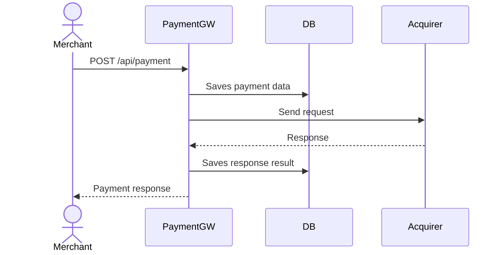

# General flow overview

## Payment Processing


## Retrieving payment data
```mermaid
sequenceDiagram
  actor client as Merchant
  participant service as PaymentGW
  participant db as DB

  client->>service: GET /api/payment/:id
  service->>db: Retrieve payment data
  db-->>service: Return data
  service-->>client: Return payment data
 ``` 
  
