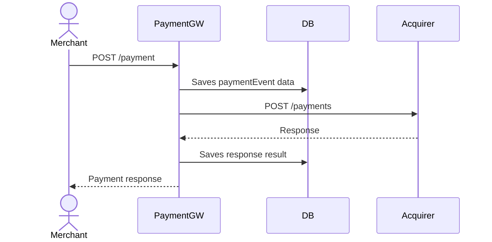
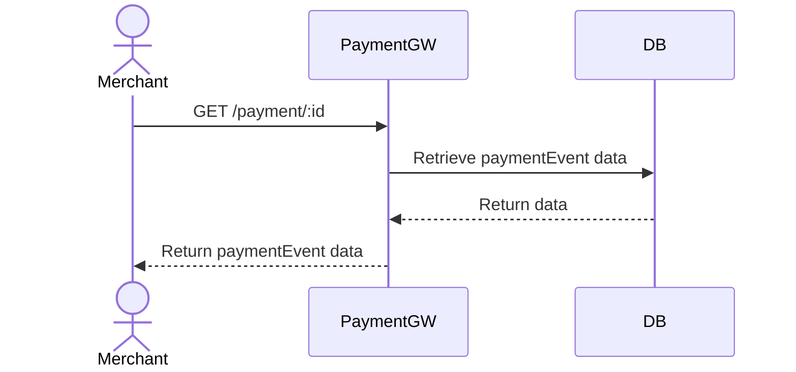

### Table of Contents
- [General flow overview](#general-flow-overview)
- [How to run application](#how-to-run-)
- [Running Integration Tests](#integration-tests)
- [API contract](#api-contract)
- [Considerations and concerns](#considerations-and-concerns)

## General flow overview

## Payment Processing


## Retrieving paymentEvent data

  // Start Payment GW app
  ./gradlew bootRun 
  OR
  ./gradlew clean build
  java -jar .\build\libs\payment-gateway-challenge-java-0.0.1-SNAPSHOT.jar
  
  // Start montebank stub service
  docker compose up -d
```

## Integration tests
```
  Build is independant of integrationTests. Runs separately.
  Integration tests are placed under test/java/com/checkout/payment/gateway/integration
  
  // Start montebank stub service
  docker compose up -d
  
  //Run integration tests
  ./gradlew integrationTest
```
## API contract
## Process Payment
### ```POST /payments```
Accept paymentEvent process request. Request saved in repository and passed to acquiring bank

### Request Payload
```
{
  "amount": 1000,
  "currency": "GBP",
  "card_number": "4242424242424247",
  "expiry_month": 12,
  "expiry_year": 2028,
  "cvv": "333"
}
```

### Response Payload (200)

```
{
    "id": "228bf585-fda7-4bbc-84cc-d004cc203cc0",
    "status": "Authorized",
    "cardNumberLastFour": "4247",
    "expiryMonth": 12,
    "expiryYear": 2028,
    "currency": "GBP",
    "amount": 1000
}
```
Payment processing statuses with 200 status code:
```
    Authorised/Declined
```
Payment processing error codes:
```
  400 - Bad request. Request validation failed, malformed or missing fields. Status Rejected
  503 - Upstream banking service is unavailable or timed out. Status Rejected
  500 - Unexpected server error. Status Rejected
```

## Retrieve Payment Data
### ```GET /payments/:id```
Retrieves paymentEvent details of processes paymentEvent by id
### Response Payload
```
{
    "id": "228bf585-fda7-4bbc-84cc-d004cc203cc0",
    "status": "Authorized",
    "cardNumberLastFour": "4247",
    "expiryMonth": 12,
    "expiryYear": 2028,
    "currency": "GBP",
    "amount": 1000
}
```

Payment processing error codes:
```
  404 - Not found
```

### For detailed api doc see: http://localhost:8090/swagger-ui

## Considerations and concerns

### Payment processing requests are not idempotent
Currently, process paymentEvent lacks idempotency, as this problem is out of the scope, we keep api simple.
```
  Idempotency-key: "d12a1523-d3b2-45fa-9cbd-5d92532e4d05"
```