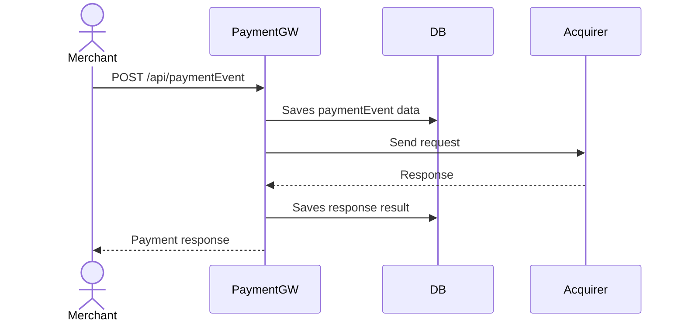

# General flow overview

## Payment Processing


## Retrieving paymentEvent data
```mermaid
sequenceDiagram
  actor client as Merchant
  participant service as PaymentGW
  participant db as DB

  client->>service: GET /api/paymentEvent/:id
  service->>db: Retrieve paymentEvent data
  db-->>service: Return data
  service-->>client: Return paymentEvent data
 ``` 
  
# API contract

## Process Payment
### ```POST /payments```
Accept paymentEvent process request. Request saved in repository and passed to acquiring bank

### Request Payload
```
{
  "amount": 1000,
  "currency": "EUR",
  "card_number": "4242424242424242",
  "expiry_month": 12,
  "expiry_year": 2028,
  "cvv": "333"
}
```

### Response Payload (201 TODO double check)

```
{
  "id": "f01e6594-d3c3-45fa-9cbc-5d92572e4d04",
  "status": "Authorized",
  "cardNumberLastFour": 4242,
  "expiryMonth": 12,
  "expiryYear": 2028,
  "currency": "EUR",
  "amount": 1000
}
```
Payment processing statuses with 201 status code:
```
    Authorised/Declined/Rejected
```
Payment processing error codes:
```
  400 - Bad request. Request validation failed, malformed or missing fields
```

## Retrieve Payment Data
### ```GET /payments/:id```
Retrieves paymentEvent details of processes paymentEvent by id
### Response Payload
```
{
  "id": "f01e6594-d3c3-45fa-9cbc-5d92572e4d04",
  "status": "Authorized",
  "cardNumberLastFour": 4242,
  "expiryMonth": 12,
  "expiryYear": 2028,
  "currency": "EUR",
  "amount": 1000
}
```

Payment processing error codes:
```
  404 - Not found
```

## Considerations and concerns

### Payment processing requests are not idempotent
Currently, process paymentEvent lacks idempotency, as this problem is out of the scope, we keep api simple.
```
  Idempotency-key: "d12a1523-d3b2-45fa-9cbd-5d92532e4d05"
```