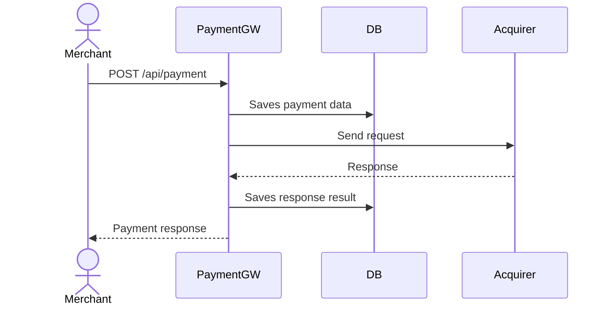

# General flow overview

## Payment Processing


## Retrieving payment data
```mermaid
sequenceDiagram
  actor client as Merchant
  participant service as PaymentGW
  participant db as DB

  client->>service: GET /api/payment/:id
  service->>db: Retrieve payment data
  db-->>service: Return data
  service-->>client: Return payment data
 ``` 
  
# API contract

## Process Payment
### ```POST /api/payments```
Accept payment process request. Request saved in repository and passed to acquiring bank
### Request Header
```
  Idempotency-key: "d12a1523-d3b2-45fa-9cbd-5d92532e4d05"
```
### Request Payload
```
{
  "amount": 1000,
  "currency": "EUR",
  "card": {
    "number": "4242424242424242",
    "expiryMonth": 12,
    "expiryYear": 2028,
    "cvv": "333"
  }
}
```

### Response Payload (201 TODO double check)

```
{
  "id": "f01e6594-d3c3-45fa-9cbc-5d92572e4d04",
  "status": "Authorized",
  "cardNumberLastFour": 4242,
  "expiryMonth": 12,
  "expiryYear": 2028,
  "currency": "EUR",
  "amount": 1000
}
```
Payment processing statuses with 201 status code:
```
    Authorised/Declined/Rejected
```
Payment processing error codes:
```
  400 - Bad request. Request validation failed, malformed or missing fields
```

#### NOTE: Left structure flat as it was initially, we don't know if there are any users of that API, so we don't break the contract

## Retrieve Payment Data
### ```GET /api/payments/:id```
Retrieves payment details of processes payment by id
### Response Payload
```
{
  "id": "f01e6594-d3c3-45fa-9cbc-5d92572e4d04",
  "status": "Authorized",
  "cardNumberLastFour": 4242,
  "expiryMonth": 12,
  "expiryYear": 2028,
  "currency": "EUR",
  "amount": 1000
}
```

Payment processing error codes:
```
  404 - Not found
```